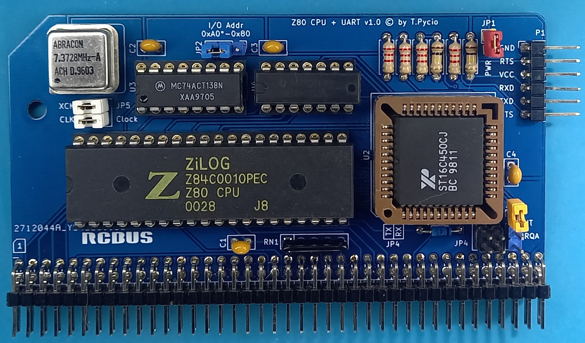

# Z80 CPU + UART 16C450/550 for RCBus

Module Z80 CPU and UART 16C450/550 for RCBus systems

## Hardware Documentation

### Schematic

[Schematic - Version 1.0](Schematic.pdf)

### Jumpers and Connectors

#### JP1 - USB power

| Position | Description |
| -------- | ----------- |
| open     | disable     |
| closed   | enable      |

External power supply and USB cannot be used at the same time

#### JP2 - UART I/O address select

| Position      | Description        |
| ------------- | ------------------ |
| 1-2           | UART address: 0x80 |
| 2-3 (default) | UART address: 0xA0 |

#### JP3 - UART interrupt select

| Position | Description       |
| -------- | ----------------- |
| 1-2      | /INT              |
| 2-3      | /IRQA             |
| open     | interrupt not use |

#### JP4 - Link RX & TX to system bus

| Position    | Description |
| ----------- | ----------- |
| both open   | disable     |
| both closed | enable      |

#### JP5 - CPU clock distribution

| Position    | Description                    |
| ----------- | ------------------------------ |
| 1-2         | from oscillator                |
| 2-3         | from bus                       |
| both closed | from oscillator to CPU and bus |

#### P1 - Serial port
Connect to USB-to-serial converter.

## Bill of Materials

| Component type     | Reference | Description                                 | Quantity |
| ------------------ | --------- | ------------------------------------------- | -------- |
| PCB                |           | Z80 + UART PCB - Version 1.0                | 1        |
| Integrated Circuit | U1        | Z84C00xxPEG - Z80 CPU, CMOS, 40 pin DIP     | 1        |
| Integrated Circuit | U2        | 16C450 or 16C550 UART, 44 pin PLCC          | 1        |
| Integrated Circuit | U3        | 74HCT138 - 3-to-8 line decoder, 16 pin DIP  | 1        |
| Integrated Circuit | U4        | 74HCT02 - Quad 2-input NOR gate, 14 pin DIP | 1        |
| Oscillator         | X1        | 7.3728 MHz, CMOS oscillator, half can       | 1        |
| Diode              | D1        | Small signal Schottky diodes BAT46, DO35    | 1        |
| Connector          | S1        | 2x40 pin header, 2.54 mm pitch, angle       | 1        |
| Connector          | P1        | 6 pin header, 2.54 mm pitch, angle          | 1        |
| Pin Header         | JP1       | 2 pin header, 2.54 mm pitch                 | 1        |
| Pin Header         | JP2,JP3   | 3 pin header, 2.54 mm pitch                 | 2        |
| Pin Header         | JP4,JP5   | 2x2 pin header, 2.54 mm pitch               | 2        |
| Capacitor          | C1 - C4   | 0.1 uF, 50V, MLCC, 2.5 mm pitch             | 4        |
| Resistor Array     | RN1       | 10 kohm, bussed, 5 pin SIP                  | 1        |
| Resistor           | R1 - R4   | 2.2 kohm, 0.25 W, axial                     | 4        |
| Resistor           | R5,R6     | 100 kohm, 0.25 W, axial                     | 2        |
| IC Socket          | U1        | 40 pin DIP                                  | 1        |
| IC Socket          | U2        | 44 pin PLCC                                 | 1        |
| IC Socket          | U3        | 16 pin DIP                                  | 1        |
| IC Socket          | U4        | 14 pin DIP                                  | 1        |
| IC Socket          | X1        | 4 pin DIP for oscillator                    | 1        |

Gerber files prepared for production at JLCPCB

## Release Notes

### Changes

* Version 1.0
  
  * Initial version

## License

Copyright 2024 Tadeusz Pycio

This work is licensed under a [Creative Commons Attribution-NonCommercial 4.0 International (CC BY-NC 4.0) ](https://creativecommons.org/licenses/by-nc/4.0/).
